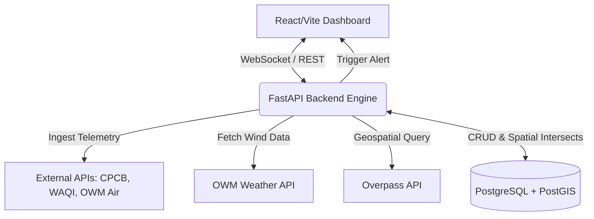

<div align="center">

# AeroTrace A(Q)I
**Real-Time Geospatial Air Quality Forensic Attribution Engine**

[](https://opensource.org/licenses/MIT)
[](https://python.org)
[](https://fastapi.tiangolo.com)
[](https://reactjs.org)
[](https://postgresql.org)
[](https://docker.com)
[](http://makeapullrequest.com)

</div>

## 📑 Table of Contents
- [About the Project](#-about-the-project)
- [Key Features](#-key-features)
- [Tech Stack](#-tech-stack)
- [System Architecture](#-system-architecture)
- [Getting Started](#-getting-started)
- [Environment Variables](#-environment-variables)
- [Usage](#-usage)
- [Contributing](#-contributing)
- [License](#-license)
- [Authors](#-authors)

---

## 🌍 About the Project

**AeroTrace A(Q)I** is a high-performance, real-time geospatial forensic engine designed to identify and attribute the exact sources of acute air pollution spikes. Instead of merely reporting bad air quality, AeroTrace combines live telemetry from environmental monitors with real-time meteorological data and geospatial analysis to answer the critical question: *"Where is this pollution coming from right now, and what is causing it?"*

It is built to empower municipal corporations, environmental regulators, and public health officials with automated, actionable intelligence for immediate enforcement and mitigation.

---

## ✨ Key Features

- **Live Telemetry & Spike Detection:** Continuously ingests data from CPCB, WAQI, and OpenWeatherMap Air APIs, instantly detecting abnormal pollution spikes.
- **Geospatial Wind Cone Filtering:** Utilizes PostGIS to dynamically calculate upwind trajectories and filter potential emission sources within the direct path of the wind.
- **Chemical Fingerprint Matching:** Analyzes the ratios of specific pollutants (e.g., PM2.5/PM10, CO/NO2) to match the spike against known emission profiles (e.g., vehicular exhaust, industrial combustion, waste burning).
- **Automated Forensic Action Center:** Dispatches actionable intelligence, calculating confidence scores, and recommending immediate enforcement actions (e.g., deploying inspectors, activating water sprinklers).

---

## 🛠 Tech Stack

**Frontend:**
- React (Vite)
- Tailwind CSS
- GSAP & Recharts

**Backend:**
- Python 3.10+
- FastAPI
- APScheduler

**Database & Geospatial:**
- PostgreSQL
- PostGIS
- SQLAlchemy / GeoAlchemy2

**DevOps & External APIs:**
- Docker & Docker Compose
- Overpass API (OSM)
- CPCB CAAQMS, WAQI, OpenWeatherMap

---

## 🏗 System Architecture



---

## 🚀 Getting Started

Follow these steps to set up the project locally.

### Prerequisites
- Node.js v18+
- Python 3.10+
- Docker & Docker Compose

### Installation

1. **Clone the repository**
   ```bash
   git clone https://github.com/priyamanna13/aqi-forensic-attribution-engine.git
   cd aqi-forensic-attribution-engine
   ```

2. **Start the Database**
   ```bash
   # Starts the PostgreSQL + PostGIS container in the background
   docker compose up -d db
   ```

3. **Install Backend Dependencies & Seed Data**
   ```bash
   pip install -r requirements.txt
   python db/seed_data.py
   ```

4. **Start the FastAPI Backend**
   ```bash
   python -m uvicorn api.main:app --reload --port 8000
   ```

5. **Start the Background Scheduler** (In a new terminal)
   ```bash
   python scheduler/scheduler.py
   ```

6. **Start the Frontend** (In a new terminal)
   ```bash
   cd frontend
   npm install
   npm run dev
   ```
*(Note: Windows users can simply run `start_dev.bat` from the root directory to launch all services automatically).*

---

## 🔐 Environment Variables

Create a `.env` file in the root directory and configure the following variables:

```env
# Database Configuration
POSTGRES_USER=aqi
POSTGRES_PASSWORD=aqi_pass
POSTGRES_DB=aqi
POSTGRES_HOST=localhost
POSTGRES_PORT=5432

# Third-Party APIs
OWM_API_KEY=your_openweathermap_api_key
CPCB_API_KEY=your_cpcb_api_key
WAQI_API_KEY=your_waqi_api_key
```

---

## 💻 Usage

Once all services are running:
1. Open your browser and navigate to `http://localhost:5173`.
2. Monitor the real-time Air Quality Index dashboard.
3. When a simulated or live AQI spike crosses the threshold, the system will automatically lock down the dashboard and display the **Forensic Action Center**.
4. Review the upwind telemetry, chemical fingerprint analysis, and the recommended enforcement dispatches.

---

## 🤝 Contributing

Contributions are what make the open-source community such an amazing place to learn, inspire, and create. Any contributions you make are **greatly appreciated**.

1. Fork the Project
2. Create your Feature Branch (`git checkout -b feature/AmazingFeature`)
3. Commit your Changes (`git commit -m 'Add some AmazingFeature'`)
4. Push to the Branch (`git push origin feature/AmazingFeature`)
5. Open a Pull Request

---

## 📄 License

Distributed under the MIT License. See `LICENSE` for more information.

---

## 👨‍💻 Authors

**Priya Manna**
- GitHub: [@priyamanna13](https://github.com/priyamanna13)

**Adarsh Maurya**
- GitHub: [@adarsh130905maurya](https://github.com/adarsh130905maurya)
  
**Anish Maurya**
- GitHub: [@anish76948](https://github.com/anish76948)
