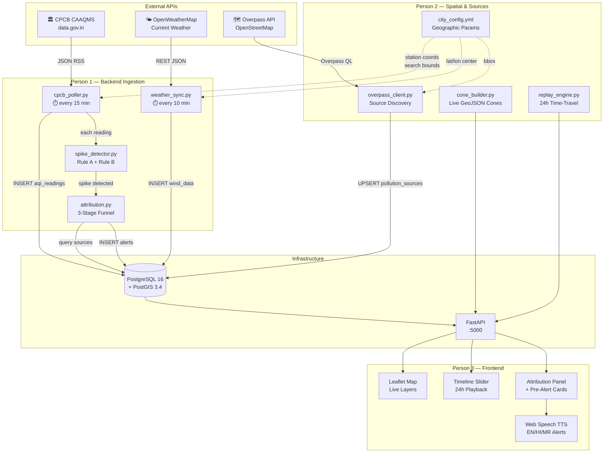

# 🏗️ New Implementation Plan Blueprint
## AI-Powered Urban Air Quality Intelligence — Live Operational Prototype
### ET AI Hackathon 2026 | Pune PoC | Deadline: July 22, 2026

---

## Executive Summary

We are transitioning from a **mock-endpoint prototype** to a **100% live data-driven operational system**. The existing codebase provides a verified foundation: PostGIS schema, 3-stage attribution funnel, FastAPI REST layer, and Docker orchestration. This plan preserves all working infrastructure and surgically replaces every hardcoded mock with live data pipelines.

> [!IMPORTANT]
> **Design Principle: Geographic-Agnostic Architecture.** Every module must accept `city_config.yml` as its sole geographic parameter. Scaling from Pune to Mumbai requires editing one YAML file and zero Python code.

---

## Current State vs. Target State

| Layer | Current (Mock) | Target (Live) |
|:---|:---|:---|
| AQI Readings | `seed_demo_scenarios.py` inserts static rows | Automated CPCB CAAQMS poller fetches every 15 min |
| Weather/Wind | `WeatherClient` calls OWM but only on spike trigger | Scheduled sync every 10 min, persisted to `wind_data` |
| Pollution Sources | 15 hand-coded sources in `seed_data.py` | Overpass API runtime query + curated municipal overlay |
| Wind Cone Geometry | Computed correctly but from seeded wind vectors | Computed from live OWM wind vectors in real-time |
| Temporal Replay | Not implemented | 24-hour sliding window with hourly tick playback |
| Voice Alerts | Frontend TTS exists but on mock text | Frontend TTS dispatches from live `localized_advisory` payloads |
| Spike Detection | Works on replay files or manual POST | Runs automatically on each polled CPCB reading |

---

## Architecture Data Flow (Live System)



---

## Project File Structure (Target)

```
aqi/
├── city_config.yml                 # [NEW] Geographic-agnostic city parameters
├── docker-compose.yml              # [MODIFY] Add scheduler service
├── Dockerfile                      # [EXISTING]
├── requirements.txt                # [MODIFY] Add apscheduler, overpy
├── .env                            # [MODIFY] Add CPCB_API_KEY
│
├── api/
│   ├── main.py                     # [MODIFY] Add replay + WebSocket endpoints
│   └── ws_manager.py               # [NEW] WebSocket broadcast for live pushes
│
├── db/
│   ├── models.py                   # [MODIFY] Add source_origin, osm_id columns
│   ├── schema.sql                  # [MODIFY] Mirror model changes
│   ├── config.py                   # [EXISTING]
│   ├── connection.py               # [EXISTING]
│   ├── geo_utils.py                # [EXISTING]
│   ├── init_db.py                  # [EXISTING]
│   └── seed_data.py                # [MODIFY] Merge with Overpass-discovered sources
│
├── pipeline/
│   ├── attribution.py              # [EXISTING - minor tweak]
│   ├── forecasting.py              # [EXISTING]
│   ├── spike_detector.py           # [EXISTING]
│   ├── weather_client.py           # [EXISTING]
│   ├── validators.py               # [EXISTING]
│   ├── pipeline_logger.py          # [EXISTING]
│   ├── pasquill.py                 # [EXISTING]
│   ├── naaqs.py                    # [EXISTING]
│   ├── station_meta.py             # [MODIFY] Read from city_config.yml
│   ├── poller.py                   # [MODIFY] Rename mock → live entry point
│   ├── cpcb_poller.py              # [NEW] Live CPCB data.gov.in ingestion
│   ├── weather_sync.py             # [NEW] Scheduled OWM wind vector sync
│   ├── overpass_client.py          # [NEW] Runtime OSM source discovery
│   ├── cone_builder.py             # [NEW] Dynamic GeoJSON cone from live wind
│   └── replay_engine.py            # [NEW] 24-hour temporal query engine
│
├── scheduler/
│   └── scheduler.py                # [NEW] APScheduler orchestrator
│
├── frontend/                       # [Person 3's workspace]
│   ├── index.html
│   ├── css/
│   ├── js/
│   │   ├── app.js                  # [MODIFY] Replace mock endpoints
│   │   ├── map_layers.js           # [MODIFY] Live layer rendering
│   │   ├── timeline.js             # [NEW] 24h replay slider
│   │   ├── tts_engine.js           # [EXISTING] Voice dispatch
│   │   └── ws_client.js            # [NEW] WebSocket live push receiver
│   └── assets/
│
└── scripts/
    ├── test_api.py                 # [MODIFY] Add replay endpoint tests
    ├── test_cpcb_poller.py         # [NEW] CPCB integration tests
    ├── test_overpass.py            # [NEW] Overpass query tests
    └── verify_live_pipeline.py     # [NEW] End-to-end live smoke test
```

---

## `city_config.yml` — The Geographic-Agnostic Keystone

```yaml
# city_config.yml — Pune, Maharashtra
# To add a new city: duplicate this file, change values, restart services.

city:
  name: "Pune"
  state: "Maharashtra"
  country: "IN"
  timezone: "Asia/Kolkata"
  center:
    lat: 18.5204
    lon: 73.8567
  bbox:  # Overpass API bounding box
    south: 18.40
    west: 73.72
    north: 18.65
    east: 73.98

stations:
  - name: "Shivajinagar"
    cpcb_station_id: "site_5029"       # CPCB CAAQMS station code
    lat: 18.5308
    lon: 73.8440
    network: "CPCB_CAAQMS"
    elevation_m: 560

  - name: "Swargate"
    cpcb_station_id: "site_5148"
    lat: 18.5018
    lon: 73.8636
    network: "CPCB_CAAQMS"
    elevation_m: 555

  - name: "Hadapsar"
    cpcb_station_id: "site_5150"
    lat: 18.5089
    lon: 73.9260
    network: "CPCB_CAAQMS"
    elevation_m: 558

  - name: "Karve Road"
    cpcb_station_id: "site_5149"
    lat: 18.5050
    lon: 73.8170
    network: "CPCB_CAAQMS"
    elevation_m: 556

polling:
  cpcb_interval_minutes: 15
  owm_interval_minutes: 10
  overpass_refresh_hours: 6

thresholds:
  spike_aqi: 150
  spike_exceedance: 1.5
  rate_of_change_delta: 50
  rate_of_change_window_seconds: 3600

search:
  max_radius_m: 5000
  min_radius_m: 1500
  wind_speed_radius_scale: 40    # radius = min(1500 + speed*40, max_radius)
```

> [!TIP]
> Every module reads `city_config.yml` at startup. Adding Nagpur or Mumbai means creating `city_config_nagpur.yml` and setting `CITY_CONFIG=city_config_nagpur.yml` in `.env`. Zero code changes.

---

## Phase-by-Phase Development Timeline

### Overview Calendar (July 5 — July 22, 2026)

| Phase | Days | Dates | Focus |
|:---:|:---:|:---:|:---|
| **1** | 1–4 | Jul 5–8 | Live Data Pipelines & Source Discovery |
| **2** | 5–8 | Jul 9–12 | Spatial Engine Upgrades & Replay System |
| **3** | 9–12 | Jul 13–16 | Frontend Live Integration & Timeline |
| **4** | 13–15 | Jul 17–19 | End-to-End Testing & Hardening |
| **5** | 16–18 | Jul 20–22 | Demo Polish, Video Recording & Submission |

---

## 🔴 MEETUP POINT #0 — Kickoff Sync (July 5, Morning)

**Duration:** 1 hour

**Collective Decisions:**
1. All three members clone the latest `main` branch and run `docker compose up -d` to verify the existing system boots.
2. Agree on `city_config.yml` structure (above). Lock it down — every module reads from this single file.
3. Confirm API keys are available:
   - `CPCB_API_KEY` — Register at [data.gov.in](https://data.gov.in) for CPCB real-time feed access.
   - `OWM_API_KEY` — Already configured; confirm the free tier's 60 calls/min limit is sufficient.
4. Person 3 confirms the frontend repo structure and Ngrok tunnel configuration.

**Contracts Locked:**
- `city_config.yml` schema (above) is frozen.
- Existing REST API contract (`API_DOCUMENTATION.md`) remains backward-compatible; new endpoints are additive only.

---

## Phase 1: Live Data Pipelines & Source Discovery (Days 1–4)

---

### Person 1 — CPCB Live Poller & Weather Sync

#### Day 1–2: `pipeline/cpcb_poller.py`

**Goal:** Replace `seed_demo_scenarios.py` with a live automated poller that fetches real-time AQI readings from CPCB CAAQMS stations in Pune.

**Data Source:** CPCB publishes near-real-time air quality data via the Central Control Room for Air Quality Management portal. Access the JSON REST API through [data.gov.in](https://data.gov.in) with an API key.

**File: `pipeline/cpcb_poller.py`**
```python
"""Live CPCB CAAQMS data ingestion pipeline.

Polls the data.gov.in CPCB endpoint every 15 minutes for the 4 Pune
stations defined in city_config.yml. Each response is validated,
normalized to the internal schema, persisted to aqi_readings, and
handed to the SpikeDetector for real-time event triggering.
"""

class CPCBPoller:
    def __init__(self, city_config: dict):
        self.stations = city_config["stations"]
        self.api_key = os.getenv("CPCB_API_KEY")
        self.interval = city_config["polling"]["cpcb_interval_minutes"]

    def fetch_station_reading(self, station_cfg: dict) -> dict | None:
        """GET the latest reading for one CPCB station.

        Returns normalized dict: {aqi, pm25, pm10, no2, so2, co, o3, timestamp}
        or None if the API is unreachable / returns stale data.
        """
        # 1. HTTP GET to data.gov.in endpoint
        # 2. Parse pollutant concentrations from JSON response
        # 3. Validate using pipeline.validators
        # 4. Return normalized reading dict
        ...

    def poll_all_stations(self, session: Session) -> list[dict]:
        """Poll all configured stations and run spike detection."""
        # For each station in city_config:
        #   1. fetch_station_reading()
        #   2. persist_reading() (from poller.py)
        #   3. SpikeDetector.check_and_trigger_spike()
        #   4. If spike → run_attribution() → persist Alert
        ...
```

**Implementation Details:**
- CPCB stations update every 15 minutes. Poll at `:00`, `:15`, `:30`, `:45` marks.
- Use `requests` with 10-second timeout and 3 retries with exponential backoff.
- Deduplicate using the existing `uq_aqi_station_timestamp` constraint (ON CONFLICT DO UPDATE).
- If the API returns stale data (same timestamp as last reading), skip without error.
- Log every poll cycle to `pipeline.log` using the existing `pipeline_logger.py`.

**Fallback Strategy:** If `data.gov.in` is unreachable for >30 minutes, generate synthetic readings using linear interpolation between the last two known values. Flag these readings with `"synthetic": true` in the JSONB.

---

#### Day 2–3: `pipeline/weather_sync.py`

**Goal:** Decouple weather fetching from spike detection. Instead of calling OWM only when a spike triggers, sync wind vectors every 10 minutes for all stations and persist to `wind_data`.

**File: `pipeline/weather_sync.py`**
```python
"""Scheduled OWM weather synchronization.

Fetches current weather for each station every 10 minutes and persists
to the wind_data table. The attribution funnel reads from wind_data
instead of making ad-hoc OWM calls during spike processing.
"""

class WeatherSyncService:
    def __init__(self, city_config: dict):
        self.stations = city_config["stations"]
        self.client = WeatherClient()  # existing class
        self.interval = city_config["polling"]["owm_interval_minutes"]

    def sync_all_stations(self, session: Session) -> int:
        """Fetch and persist current weather for all stations.
        Returns count of successful syncs.
        """
        # For each station:
        #   1. WeatherClient.get_current(lat, lon)
        #   2. INSERT INTO wind_data (station_id, timestamp, speed, dir, temp)
        #   3. Update station.last_wind_* convenience columns
        ...
```

**Implementation Details:**
- Reuse the existing `WeatherClient` and its cache fallback mechanism.
- Store the full `WeatherSnapshot` as JSONB in a new `weather_snapshot_json` column on `wind_data` (preserves all fields for the frontend without schema explosion).
- The attribution funnel's `run_attribution()` reads the latest `wind_data` row for the station instead of making a fresh OWM call.

---

#### Day 3–4: `scheduler/scheduler.py`

**Goal:** Wire the CPCB poller and weather sync into a persistent background scheduler using APScheduler.

**File: `scheduler/scheduler.py`**
```python
"""Background job scheduler for live data pipelines.

Runs as a separate process (or Docker service) that triggers:
  - CPCB polling every 15 minutes
  - OWM weather sync every 10 minutes
  - Overpass source refresh every 6 hours
"""
from apscheduler.schedulers.blocking import BlockingScheduler

def create_scheduler(city_config: dict) -> BlockingScheduler:
    scheduler = BlockingScheduler()

    scheduler.add_job(
        cpcb_poll_job,
        'interval',
        minutes=city_config["polling"]["cpcb_interval_minutes"],
        id='cpcb_poller',
        misfire_grace_time=60,
    )

    scheduler.add_job(
        weather_sync_job,
        'interval',
        minutes=city_config["polling"]["owm_interval_minutes"],
        id='weather_sync',
        misfire_grace_time=60,
    )

    scheduler.add_job(
        overpass_refresh_job,
        'interval',
        hours=city_config["polling"]["overpass_refresh_hours"],
        id='overpass_refresh',
        misfire_grace_time=300,
    )

    return scheduler
```

**Docker Integration:** Add a `scheduler` service to `docker-compose.yml`:
```yaml
  scheduler:
    build: .
    container_name: aqi-scheduler
    command: ["python", "-m", "scheduler.scheduler"]
    environment:
      - POSTGRES_HOST=db
      - OWM_API_KEY=${OWM_API_KEY}
      - CPCB_API_KEY=${CPCB_API_KEY}
      - CITY_CONFIG=city_config.yml
    depends_on:
      db:
        condition: service_healthy
```

---

### Person 2 — Overpass Source Discovery & Dynamic Coning

#### Day 1–3: `pipeline/overpass_client.py`

**Goal:** Replace the 15 hand-coded pollution sources in `seed_data.py` with live OpenStreetMap queries that discover industrial zones, construction sites, and traffic corridors within the city bounding box.

**File: `pipeline/overpass_client.py`**
```python
"""Runtime pollution source discovery via Overpass API.

Queries OpenStreetMap for tagged features within the city bbox:
  - landuse=industrial → industrial sources
  - building=construction → active construction
  - highway=trunk|primary → major traffic corridors
  - amenity=waste_disposal → waste burning sites

Discovered sources are UPSERTed into pollution_sources with
source_origin='osm' to distinguish them from curated municipal entries.
"""

OVERPASS_URL = "https://overpass-api.de/api/interpreter"

OVERPASS_QUERIES = {
    "industrial": """
        [out:json][timeout:30];
        (
          way["landuse"="industrial"]({bbox});
          relation["landuse"="industrial"]({bbox});
        );
        out center geom;
    """,
    "construction": """
        [out:json][timeout:30];
        (
          way["building"="construction"]({bbox});
          node["construction"="yes"]({bbox});
        );
        out center geom;
    """,
    "traffic": """
        [out:json][timeout:30];
        (
          way["highway"~"trunk|primary|secondary"]["lanes">=4]({bbox});
        );
        out geom;
    """,
    "waste_burning": """
        [out:json][timeout:30];
        (
          node["amenity"="waste_disposal"]({bbox});
          way["landuse"="landfill"]({bbox});
        );
        out center geom;
    """,
}

class OverpassSourceDiscovery:
    def __init__(self, city_config: dict):
        self.bbox = city_config["city"]["bbox"]  # south,west,north,east

    def discover_sources(self, session: Session) -> int:
        """Run all Overpass queries and UPSERT into pollution_sources.
        Returns count of sources discovered.
        """
        # For each query type:
        #   1. Format bbox into Overpass QL
        #   2. POST to Overpass API
        #   3. Parse GeoJSON geometries (Point/Polygon/LineString)
        #   4. UPSERT using ON CONFLICT (osm_id) DO UPDATE
        #   5. Tag source_origin = 'osm'
        ...
```

**Schema Change Required (`db/models.py`):**
```python
# Add to PollutionSource model:
osm_id: Mapped[Optional[str]] = mapped_column(String(50), nullable=True, unique=True)
source_origin: Mapped[str] = mapped_column(
    String(20), nullable=False, server_default=text("'curated'")
)
# Constraint: source_origin IN ('curated', 'osm', 'municipal')
description: Mapped[Optional[str]] = mapped_column(Text, nullable=True)
```

**Implementation Details:**
- Overpass API is free and requires no API key. Rate limit: 2 requests per 10 seconds.
- Batch all 4 query types sequentially with 5-second delays between.
- Preserve manually curated sources (the existing 15) by marking them `source_origin='curated'`.
- OSM-discovered sources get `source_origin='osm'` and can be overridden by curated entries.
- Schedule a refresh every 6 hours (construction sites appear/disappear over days).

---

#### Day 3–4: `pipeline/cone_builder.py`

**Goal:** Extract the wind-cone GeoJSON generation logic from `attribution.py` into a standalone module that can compute cones from any wind vector at any timestamp — enabling both live and replay modes.

**File: `pipeline/cone_builder.py`**
```python
"""Dynamic GeoJSON wind cone builder.

Generates standard GeoJSON Feature polygons representing the upwind
source search area. Accepts live wind parameters and computes:
  - Dynamic half-angle from wind speed (calm→90°, moderate→60°, strong→30°)
  - Dynamic reach from wind speed and stability class
  - UTM-projected polygon vertices for meter-accurate arcs

This module is called by:
  1. attribution.py — during live spike processing
  2. replay_engine.py — when generating historical wind cones
  3. api/main.py — for the /api/v1/cone endpoint (ad-hoc queries)
"""

def build_wind_cone(
    station_lon: float,
    station_lat: float,
    wind_direction_deg: float,
    wind_speed_kmh: float,
    pasquill_class: str = "D",
    num_arc_points: int = 32,
) -> dict:
    """Return a GeoJSON Feature with the wind cone polygon and metadata."""
    ...
```

**Extraction Rationale:** Currently, cone logic is embedded inside `run_attribution()` in `attribution.py`. Extracting it enables Person 3's replay timeline to request cones for any historical timestamp without running the full attribution funnel.

---

### Person 3 — Frontend Preparation & API Abstraction

#### Day 1–4: API Abstraction Layer

**Goal:** Replace all hardcoded Ngrok URLs and mock JSON files with a clean API client class that reads the backend base URL from a single config constant.

**File: `frontend/js/api_client.js`**
```javascript
/**
 * Centralized API client. Every fetch in the app goes through this.
 * To switch between local Docker, Ngrok, or production: change BASE_URL.
 */
const API = {
    BASE_URL: window.location.origin,  // auto-detects

    async getStations() { ... },
    async getLatestSpike(stationName) { ... },
    async getAlerts(stationName, limit = 10) { ... },
    async getSources() { ... },
    async getPreAlerts(timestamp = null) { ... },
    async postAttribution(payload) { ... },

    // NEW endpoints for live system:
    async getReplaySnapshot(stationName, timestamp) { ... },
    async getWindCone(stationName, timestamp = null) { ... },
}
```

**Also:**
- Wire all existing Leaflet map layer rendering to use the `API` client.
- Verify that the TTS engine (`tts_engine.js`) correctly reads the `localized_advisory.en/hi/mr` fields from real API responses.
- Replace any hardcoded GeoJSON coordinate files with live `/attribution/sources` calls.

---

## 🟡 MEETUP POINT #1 — Pipeline Integration Check (July 9, Morning)

**Duration:** 2 hours

**Collective Verification:**
1. **Person 1 demos:** Run `python -m scheduler.scheduler` and show CPCB readings flowing into `aqi_readings` every 15 minutes. Show `wind_data` rows appearing every 10 minutes.
2. **Person 2 demos:** Run `overpass_client.py` and show new `pollution_sources` rows appearing with `source_origin='osm'`. Show `cone_builder.py` generating valid GeoJSON from live wind vectors.
3. **Person 3 demos:** Show the map loading stations from the live API instead of mock JSON.

**Decisions to Make:**
1. Verify CPCB API response format matches our parser. If the JSON schema differs from expected, Person 1 adjusts the normalizer.
2. Agree on the Overpass query filters — are we capturing too many or too few sources? Tune the OSM tag filters.
3. Lock down the replay API contract (see Phase 2).

**Contracts Locked:**
- New endpoint: `GET /api/v1/replay/{station_name}?timestamp=ISO8601` — returns the full attribution payload as it would have looked at that historical moment.
- New endpoint: `GET /api/v1/cone/{station_name}?timestamp=ISO8601` — returns just the wind cone GeoJSON for a given moment.

---

## Phase 2: Replay System & Spatial Upgrades (Days 5–8)

---

### Person 1 — Replay API Endpoints

#### Day 5–6: `pipeline/replay_engine.py`

**Goal:** Build a temporal query engine that reconstructs the full attribution payload for any historical timestamp within the last 24 hours.

**File: `pipeline/replay_engine.py`**
```python
"""24-hour temporal replay engine.

Given a station and a timestamp, reconstructs what the attribution
result would have been at that moment by:
  1. Finding the nearest aqi_reading at or before the timestamp
  2. Finding the nearest wind_data snapshot at or before the timestamp
  3. Running the attribution funnel with those historical parameters
  4. Returning the full contract payload (identical structure to live)
"""

def replay_at_timestamp(
    session: Session,
    station_name: str,
    target_ts: datetime,
    city_config: dict,
) -> dict | None:
    """Reconstruct the attribution state at a specific historical moment.

    Returns the full data contract payload, or None if insufficient
    historical data exists for the requested timestamp.
    """
    # 1. Find closest aqi_reading <= target_ts
    # 2. Find closest wind_data <= target_ts
    # 3. If reading was a spike → run full attribution
    # 4. If reading was normal → return {spike_detected: false, aqi: X, wind_cone: ...}
    # 5. Always include the wind cone geometry (even without spike)
    ...

def get_24h_tick_summary(
    session: Session,
    station_name: str,
) -> list[dict]:
    """Return a summary array of 24 hourly ticks for timeline rendering.

    Each tick: {timestamp, aqi, was_spike, dominant_pollutant, wind_dir, wind_speed}
    """
    ...
```

#### Day 6–7: New API Endpoints in `api/main.py`

```python
@app.get("/api/v1/replay/{station_name}", tags=["Replay"])
def replay_snapshot(
    station_name: str,
    timestamp: str = Query(..., description="ISO 8601 timestamp"),
    session: Session = Depends(get_db),
):
    """Reconstruct attribution state at a historical timestamp."""
    ...

@app.get("/api/v1/timeline/{station_name}", tags=["Replay"])
def timeline_ticks(
    station_name: str,
    session: Session = Depends(get_db),
):
    """Return 24 hourly tick summaries for the timeline slider."""
    ...

@app.get("/api/v1/cone/{station_name}", tags=["Spatial"])
def wind_cone(
    station_name: str,
    timestamp: str = Query(None, description="ISO 8601; defaults to now"),
    session: Session = Depends(get_db),
):
    """Return the wind cone GeoJSON for a station at a given moment."""
    ...
```

---

### Person 2 — Live Spatial Engine Wiring

#### Day 5–7: Wire `cone_builder.py` into Attribution

**Goal:** Modify `attribution.py` to read wind vectors from `wind_data` table (populated by `weather_sync.py`) instead of making ad-hoc OWM calls.

**Changes to `pipeline/attribution.py`:**
```python
# BEFORE (current):
weather = WeatherClient().get_current(station_lat, station_lon)

# AFTER (live):
wind_row = session.execute(
    select(WindData)
    .where(WindData.station_id == station_id)
    .order_by(WindData.timestamp.desc())
    .limit(1)
).scalars().first()

weather = json.loads(wind_row.weather_snapshot_json)
```

**Also:**
- Modify `cone_builder.py` to accept an optional `search_radius_override` parameter from `city_config.yml`.
- Add a `SRID 32643` (UTM Zone 43N for Pune) constant to `city_config.yml` for correct meter-based distance calculations.
- Test that the Overpass-discovered sources appear correctly in the spatial filter stage of the funnel.

#### Day 7–8: Merge Curated + OSM Sources

**Goal:** Ensure the attribution funnel queries both curated (existing 15) and OSM-discovered sources seamlessly.

**Implementation:**
- The `pollution_sources` table already holds both; the spatial query (`ST_DWithin`) naturally includes all rows regardless of `source_origin`.
- Add a `source_origin` field to the ranked candidates response so the frontend can style curated vs. discovered sources differently (e.g., solid border vs. dashed border).

---

### Person 3 — Timeline Slider Component

#### Day 5–8: `frontend/js/timeline.js`

**Goal:** Build a horizontal timeline slider that spans 24 hours. When the user drags the thumb or clicks a tick, the entire map updates: wind cone rotates, source rankings re-shuffle, and AQI badge changes.

**Component Architecture:**
```javascript
/**
 * TimelineSlider — 24-hour playback component.
 *
 * Renders a horizontal slider with 24 tick marks (one per hour).
 * Each tick is color-coded by AQI severity (green → red).
 *
 * On tick selection:
 *   1. Calls API.getReplaySnapshot(station, timestamp)
 *   2. Updates wind cone layer on the map
 *   3. Updates candidate list panel
 *   4. Updates AQI badge
 *   5. Optionally triggers TTS for the new advisory
 *
 * Autoplay mode: advances one tick every 2 seconds.
 */
class TimelineSlider {
    constructor(containerId, stationName) { ... }

    async loadTicks() {
        // GET /api/v1/timeline/{station} → [{ts, aqi, was_spike, ...}, ...]
        ...
    }

    async onTickSelected(tickIndex) {
        // GET /api/v1/replay/{station}?timestamp=...
        // Update all map layers
        ...
    }

    startAutoplay(intervalMs = 2000) { ... }
    stopAutoplay() { ... }
}
```

**Design Requirements:**
- Tick marks are circles. Color: green (<100), yellow (100-200), orange (200-300), red (>300).
- Active tick is enlarged and pulsing.
- A "play" button starts autoplay; a "pause" button stops it.
- The slider bar shows a gradient of AQI colors across the 24 hours.

---

## 🟢 MEETUP POINT #2 — Replay Integration Test (July 13, Morning)

**Duration:** 2 hours

**Collective Verification:**
1. **Person 1 demos:** Hit `GET /api/v1/timeline/Shivajinagar` and show 24 tick objects with real data. Hit `GET /api/v1/replay/Shivajinagar?timestamp=2026-07-12T14:00:00+05:30` and show a full attribution payload.
2. **Person 2 demos:** Show that the wind cone rotates correctly across different historical timestamps. Show that OSM-discovered sources appear in ranked candidates.
3. **Person 3 demos:** Drag the timeline slider and show the map updating live. Show autoplay mode cycling through 24 hours.

**Decisions to Make:**
1. Is the autoplay speed correct (2 seconds per tick)? Adjust if too fast/slow for demo.
2. Should we show the pre-alert panel during replay mode, or only in live mode?
3. Final decision on the TTS: should it speak on every tick change, or only on spike ticks?

**Contracts Locked:**
- Replay response schema is frozen. No more field additions.
- Timeline tick summary schema is frozen.
- WebSocket push message format is locked (for Phase 3 live push).

---

## Phase 3: Live Push, Voice Alerts & UI Polish (Days 9–12)

---

### Person 1 — WebSocket Live Push

#### Day 9–10: `api/ws_manager.py`

**Goal:** When the scheduler detects a new spike via the CPCB poller, broadcast the full attribution payload to all connected frontend clients via WebSocket — no polling required.

**File: `api/ws_manager.py`**
```python
"""WebSocket connection manager for live spike push notifications."""

from fastapi import WebSocket

class ConnectionManager:
    def __init__(self):
        self.active_connections: list[WebSocket] = []

    async def connect(self, websocket: WebSocket):
        await websocket.accept()
        self.active_connections.append(websocket)

    def disconnect(self, websocket: WebSocket):
        self.active_connections.remove(websocket)

    async def broadcast(self, message: dict):
        """Push a spike payload to all connected clients."""
        for connection in self.active_connections:
            await connection.send_json(message)
```

**Integration with `api/main.py`:**
```python
manager = ConnectionManager()

@app.websocket("/ws/live")
async def websocket_endpoint(websocket: WebSocket):
    await manager.connect(websocket)
    try:
        while True:
            await websocket.receive_text()  # keep-alive
    except WebSocketDisconnect:
        manager.disconnect(websocket)
```

**Integration with Scheduler:**
When `cpcb_poller.py` detects a spike, it calls an internal HTTP endpoint or uses a shared queue to push the payload to the WebSocket manager.

---

### Person 2 — Spatial Optimization & Edge Cases

#### Day 9–11: Edge Case Hardening

- **Calm wind ($< 0.5$ m/s):** Already handled (360° circle search). Verify with live OWM data.
- **Missing wind data:** If `wind_data` table has no recent row (>30 min old), fall back to the OWM cache mechanism already in `weather_client.py`.
- **Zero sources in cone:** Return `ambiguous: true` with an empty candidates array and a special advisory: "No emission sources identified in the upwind search area. Possible transported pollution."
- **Overpass timeout:** If the Overpass API is unreachable during scheduled refresh, keep the existing sources in the database. Log a warning. Retry on the next cycle.

---

### Person 3 — Voice Alerts & UI Polish

#### Day 9–10: WebSocket Integration

**File: `frontend/js/ws_client.js`**
```javascript
/**
 * WebSocket client for live spike push notifications.
 * When a new spike arrives, the map auto-centers on the affected station,
 * the attribution panel opens, and TTS dispatches the localized advisory.
 */
class LivePushClient {
    constructor(baseUrl) {
        this.ws = new WebSocket(`ws://${baseUrl}/ws/live`);
        this.ws.onmessage = (event) => this.handleSpike(JSON.parse(event.data));
    }

    handleSpike(payload) {
        // 1. Flash the station marker red
        // 2. Update the attribution panel
        // 3. Rotate the wind cone to the new direction
        // 4. Trigger TTS: speak(payload.actionable_intelligence.localized_advisory)
        ...
    }
}
```

#### Day 10–12: UI Polish & Micro-Animations

- **Station markers:** Pulse animation when AQI > 200. Color-coded by severity.
- **Wind cone:** Semi-transparent gradient fill. Animated sweep on direction change.
- **Attribution panel:** Slide-in from right. Candidate cards with confidence bar visualizations.
- **Pre-alert cards:** Countdown timer that ticks down in real-time using `eta_minutes`.
- **Language switcher:** Three-button toggle (EN/HI/MR) that instantly re-renders all text and re-dispatches TTS.
- **Responsive layout:** Works on 1080p projector (demo scenario) and 4K monitors.

---

## 🔵 MEETUP POINT #3 — Full Integration Smoke Test (July 17, Morning)

**Duration:** 3 hours

**End-to-End Test Procedure:**
1. Start Docker: `docker compose up -d` (db + backend + scheduler).
2. Wait 15 minutes for the first CPCB poll cycle.
3. Verify: `aqi_readings` table has new rows with real timestamps.
4. Verify: `wind_data` table has new rows every 10 minutes.
5. Open the frontend dashboard. Verify stations render with live AQI values.
6. If no natural spike occurs, manually POST a high-AQI reading via `/attribution/run`.
7. Verify: WebSocket pushes the spike to the frontend automatically.
8. Verify: TTS speaks the advisory in the selected language.
9. Drag the timeline slider. Verify: map updates with historical data.
10. Run all existing test suites: `test_api.py`, `test_attribution.py`, `test_validation.py`.

**Decisions to Make:**
1. Feature freeze decision: any unfinished features are cut.
2. Identify the 3 strongest demo scenarios for the video.
3. Assign presentation speaking roles.

---

## Phase 4: Hardening & Demo Preparation (Days 13–15)

---

### All Three Members — Collaborative

#### Day 13: Stress Testing & Error Handling
- Simulate OWM API downtime → verify cache fallback works.
- Simulate CPCB returning stale data → verify deduplication.
- Simulate Overpass timeout → verify existing sources are preserved.
- Test with 100+ sources in the database → verify spatial query performance (<100ms).

#### Day 14: Demo Scenario Scripting
1. **Scenario A — Live Spike Detection:** Wait for (or trigger) a real spike. Show the full pipeline: detection → attribution → advisory → TTS.
2. **Scenario B — 24-Hour Replay:** Drag the timeline through yesterday's data. Show wind cone rotation and candidate re-ranking.
3. **Scenario C — Multi-Language Alert:** Switch between EN/HI/MR and show TTS dispatching in each language.
4. **Scenario D — Pre-Alert Forecast:** Show the pre-alert countdown card predicting an upcoming pollution event.

#### Day 15: Video Recording
- Screen-record the 4 demo scenarios.
- Voice-over explaining the architecture and novelty.
- Edit to under 5 minutes.
- Export as MP4 for submission.

---

## 🟣 MEETUP POINT #4 — Final Rehearsal (July 20, Morning)

**Duration:** Full day

**Checklist:**
- [ ] All Docker services start cleanly on a fresh `docker compose up -d`.
- [ ] CPCB poller has been running for 48+ hours without crashes.
- [ ] At least 3 natural spikes have been captured and attributed.
- [ ] Timeline shows 24 real hourly data points.
- [ ] TTS works in Chrome, Edge, and Firefox.
- [ ] Video is recorded, edited, and under 5 minutes.
- [ ] README.md is updated with setup instructions for judges.
- [ ] `.env.example` has all required keys documented.

---

## New Dependencies to Add

```
# requirements.txt additions
apscheduler>=3.10,<4.0          # Background job scheduling
overpy>=0.7,<1.0                # Overpass API Python client (optional, can use raw requests)
websockets>=12.0,<14.0          # WebSocket support (already bundled with uvicorn[standard])
```

---

## Risk Mitigation Matrix

| Risk | Probability | Impact | Mitigation |
|:---|:---:|:---:|:---|
| CPCB API changes format | Medium | High | Parse defensively; log raw responses for debugging |
| CPCB API goes down | Low | High | Synthetic interpolation fallback + cache |
| OWM rate limit hit | Low | Medium | 10-min interval = 6 calls/hr/station = 24/hr total (well under 60/min limit) |
| Overpass API timeout | Medium | Low | Keep existing sources; retry next cycle |
| No natural spike during demo | High | Critical | Keep `seed_demo_scenarios.py` as manual trigger option |
| WebSocket drops on slow networks | Medium | Medium | Frontend auto-reconnects with 5-second backoff |

---

## Summary: Person-Wise Task Count

| Person | New Files | Modified Files | Total Tasks |
|:---:|:---:|:---:|:---:|
| **Person 1** (Backend & Ingestion) | 4 (`cpcb_poller`, `weather_sync`, `scheduler`, `ws_manager`) | 3 (`api/main.py`, `poller.py`, `requirements.txt`) | 7 |
| **Person 2** (Spatial & Sources) | 3 (`overpass_client`, `cone_builder`, `replay_engine`) | 3 (`attribution.py`, `models.py`, `schema.sql`) | 6 |
| **Person 3** (Frontend & UX) | 3 (`timeline.js`, `ws_client.js`, `api_client.js`) | 3 (`app.js`, `map_layers.js`, `index.html`) | 6 |

> [!CAUTION]
> **Feature Freeze: July 17 (Day 13).** No new features after this date. Days 14–18 are exclusively for testing, demo scripting, and video recording. Violating this boundary has historically caused more hackathon failures than any technical issue.
