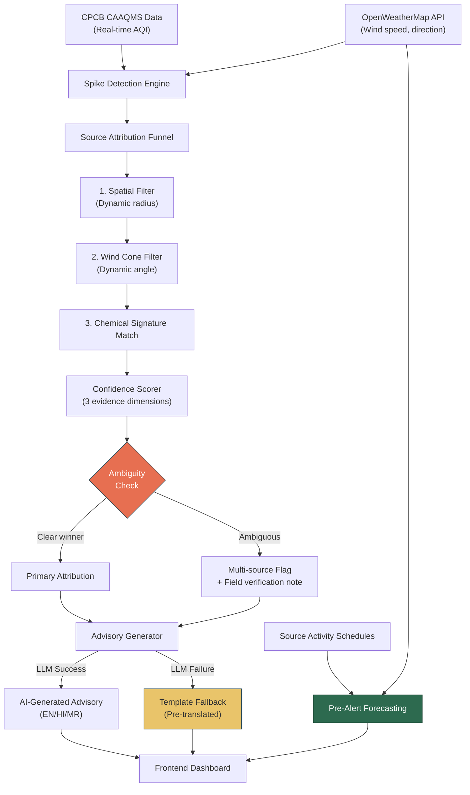
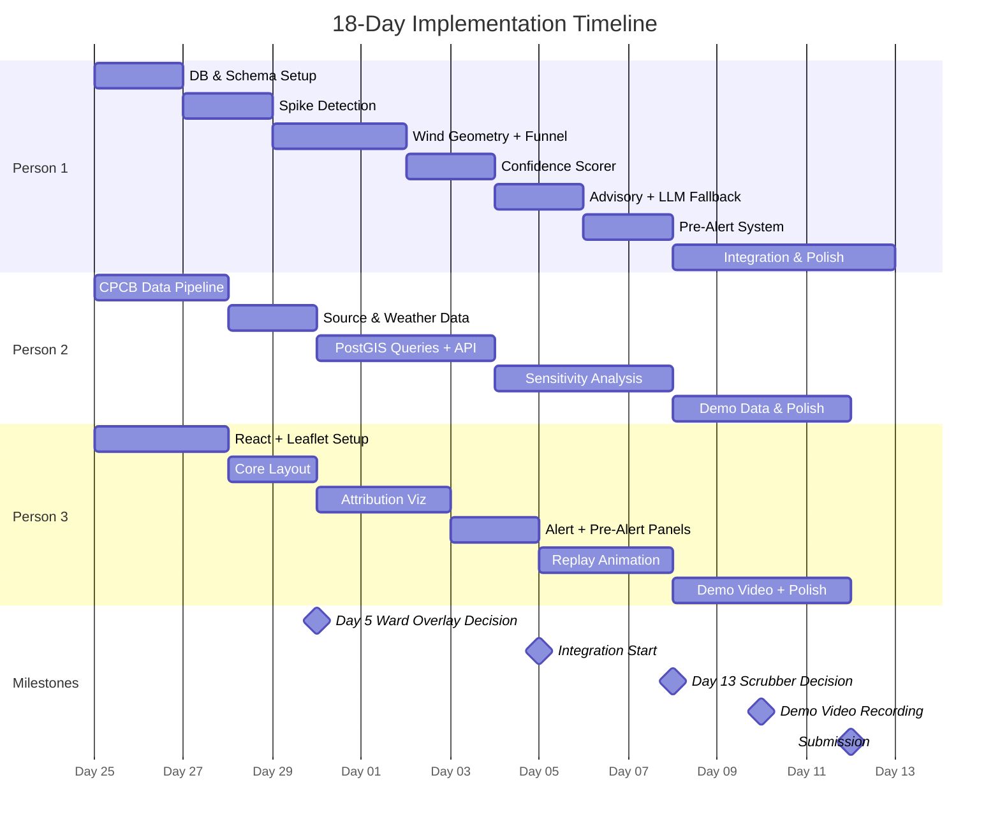

# PS5: AI-Powered Urban Air Quality Intelligence — Improved Implementation Plan

> **Team Size:** 3 members · **Timeline:** 18 days · **Target City:** Single city (Pune/Mumbai recommended)

---

## Executive Summary

Build a **proactive air quality intelligence platform** that takes a sensor AQI spike, finds upwind sources within a dynamic radius, scores them across three evidence dimensions, generates a multilingual advisory, and displays it on an animated map — shifting from reactive monitoring to **predictive pre-alerting**.

### What Makes This Stand Out

> [!IMPORTANT]
> Our differentiator is **explainable, attributive intelligence** — not just prediction.
>
> The architecture slide showing `1,847 possible sources → 23 within dynamic radius → 6 chemically matching → 2 surviving candidates → 1 primary attribution` **IS the differentiator**. This slide is not optional.

Most competing teams will fall into two traps:
- **Route A:** "We trained an ML model" → fails because no real training data in 18 days, no explainability
- **Route B:** "We built a prettier CPCB dashboard" → zero novelty

Our funnel approach is neither. It's explainable, attributive, and directly answers the PS question.

---

## Critical Improvements Incorporated

| # | Improvement | Effort | Owner | Priority |
|---|-------------|--------|-------|----------|
| 1 | Dynamic cone angle (wind-speed aware) | 30 min | Person 1 | 🔴 High |
| 2 | Dynamic search radius | 15 min | Person 2 | 🔴 High |
| 3 | Replace "mock confusion matrix" → **sensitivity analysis** | Deck only | All | 🔴 High |
| 4 | LLM fallback template (multilingual) | 1 hour | Person 1 | 🟡 Medium |
| 5 | Ambiguity flag for multi-source scenarios | 30 min | Person 1 | 🟡 Medium |
| 6 | **Pre-alert forecasting system** (NEW — upgrades from "good" to "winning") | 3-4 hours | Person 1 + Person 2 | 🔴 High |
| 7 | Person 3's Day 13 cutoff decision | Process | All | 🟡 Medium |

**Total additional effort:** ~6-7 hours distributed across the team.

---

## 🤝 Mandatory Team Sync Sessions

These are sessions where **all 3 members must be present together**. Do not skip these — most integration failures and wasted work come from misalignment that a 30-minute sync would have prevented.

### Scheduled Sync Sessions

| Day | Session | Duration | Who | Purpose | Deliverable |
|-----|---------|----------|-----|---------|-------------|
| **Day 1** | 🚀 Kickoff & Architecture Alignment | 2 hours | All 3 | Walk through this entire plan together. Agree on tech stack versions, city choice, repo structure, branch strategy. | Shared repo initialized, everyone can run the project locally |
| **Day 3** | 📋 API Contract Definition | 1.5 hours | All 3 | Person 1 + Person 2 define every API endpoint's request/response JSON schema. Person 3 reviews to confirm frontend needs are covered. | Written API contract document (even a shared Google Doc). Person 3 can start building with mock data against these contracts. |
| **Day 5** | 🔍 Decision Gate #1 | 30 min | All 3 | Review Person 3's progress on core map. **Decision:** keep or cut ward boundary overlay. Review Person 2's data pipeline — is real CPCB data flowing? | Go/no-go on ward overlay. Confirmation that data pipeline works. |
| **Day 9** | 🔗 Pre-Integration Check | 1 hour | All 3 | Person 1 demos the attribution pipeline running end-to-end (even with mock data). Person 2 demos API endpoints returning real responses. Person 3 demos the frontend consuming mock API responses. Identify any contract mismatches NOW. | List of integration blockers (ideally zero). |
| **Day 10–11** | 🛠️ Integration Sprint | 3-4 hours (split across 2 days) | All 3 | **Sit together.** Connect frontend → API → pipeline live. This is where most bugs surface — different date formats, missing fields, CORS issues, coordinate system mismatches. Debug together in real-time. | Frontend successfully showing real attribution results from live pipeline. |
| **Day 13** | 🔍 Decision Gate #2 | 30 min | All 3 | **Decision:** keep or cut replay scrubber. Review pre-alert system integration. Identify remaining bugs. | Final feature freeze decision. |
| **Day 14** | 🎬 Demo Scenario Scripting | 1.5 hours | All 3 | Together, walk through each demo scenario end-to-end. Decide exact click sequence, what to show, what to narrate. Write the script. Person 2 ensures demo data is seeded correctly for each scenario. | Written demo script with exact steps. |
| **Day 15** | 📊 Presentation Deck Working Session | 2 hours | All 3 | Build the deck together. Each person owns their slides but the **funnel architecture slide** and **sensitivity analysis slide** need everyone's input. | Draft deck ready for rehearsal. |
| **Day 16** | 🎤 Presentation Rehearsal #1 | 1 hour | All 3 | Full dry run. Time it. Identify weak explanations, missing transitions, slides that confuse. | Feedback list, revised slide order. |
| **Day 17** | 🎤 Presentation Rehearsal #2 + Video Recording | 2 hours | All 3 | Final rehearsal, then record the demo video. Have a backup plan if screen recording has issues. | Final demo video recorded and edited. |

### Daily Standups (15 min, every day)

> [!TIP]
> Even if you're working remotely, do a **15-minute daily standup** (text on WhatsApp/Slack is fine if you can't call). Each person answers three questions:
> 1. What did I finish yesterday?
> 2. What am I doing today?
> 3. Am I blocked on anything?
>
> This catches problems early. If Person 3 says "I need the `/api/sources` endpoint to test my map" and Person 2 hasn't built it yet, you catch this on Day 4 instead of Day 10.

### Pair Programming Sessions (Ad-hoc, as needed)

These are **not mandatory** but strongly recommended when:

| Situation | Who Should Pair | When |
|-----------|----------------|------|
| Wind cone geometry rendering on map doesn't match backend cone calculation | Person 1 + Person 3 | Days 6–8 |
| PostGIS spatial query returns unexpected results | Person 1 + Person 2 | Days 6–7 |
| API response format doesn't match what frontend expects | Person 2 + Person 3 | Days 10–11 |
| Pre-alert countdown timer logic doesn't sync with backend ETA | Person 1 + Person 3 | Days 11–12 |
| Sensitivity analysis test cases need pipeline understanding | Person 1 + Person 2 | Days 10–12 |
| Demo data seeding doesn't produce the visual result expected | All 3 | Day 14 |

---

## Architecture Overview



---

## Team Responsibilities

---

## 🔵 Person 1 — Backend & Intelligence Pipeline

**Role:** Core pipeline, attribution logic, advisory generation, forecasting

### Phase 1: Foundation (Days 1–5)

#### Database & Schema Setup (Days 1–2)
- [ ] Set up PostgreSQL + PostGIS
- [ ] Create schema: `stations`, `aqi_readings`, `pollution_sources`, `wind_data`, `alerts`
- [ ] Seed station data from CPCB (one city)
- [ ] Seed source data (industries, construction sites, traffic corridors) from municipal records / OpenStreetMap

#### Spike Detection Engine (Days 3–4)
- [ ] Build AQI spike detection logic (threshold-based + rate-of-change)
- [ ] Connect to CPCB API for real-time readings (or scheduled polling)
- [ ] Connect to OpenWeatherMap API for wind data
- [ ] Store historical readings for replay

#### Dynamic Wind-Aware Search Geometry (Day 5)

> [!IMPORTANT]
> **Improvement #1 & #2 — Dynamic Cone Angle + Dynamic Search Radius**
>
> These replace the original fixed 45° cone and fixed 2km radius.
> Cite as **"simplified Pasquill-Gifford dispersion class approximation"** in the presentation — this is the actual meteorology term and will impress judges.

```python
def get_cone_angle(wind_speed_kmh):
    """
    Wind-speed-dependent cone angle.
    Low wind = wide scatter, high wind = narrow corridor.
    Based on simplified Pasquill-Gifford stability classes.
    """
    if wind_speed_kmh < 5:
        return 90   # low wind, wide scatter
    elif wind_speed_kmh < 15:
        return 60
    elif wind_speed_kmh < 25:
        return 45
    else:
        return 30   # strong wind, narrow corridor


def get_search_radius_m(wind_speed_kmh):
    """
    Dynamic search radius: faster wind = pollutant travels further.
    Range: 1500m to 3000m.
    """
    base = 1500
    return min(base + (wind_speed_kmh * 40), 3000)  # caps at 3km
```

**Justification for 2km midpoint (for presentation deck):** Studies on urban PM10 dispersion in Indian cities show measurable sensor impact from sources within 1.5–3km depending on wind speed and stability class. Our dynamic radius uses 1.5km as a base and scales up to 3km — covering the validated range.

### Phase 2: Attribution Pipeline (Days 5–9)

#### Source Attribution Funnel (Days 5–7)
- [ ] **Stage 1 — Spatial Filter:** PostGIS query using `get_search_radius_m()` to find sources within dynamic radius
- [ ] **Stage 2 — Wind Cone Filter:** Geometric filter using `get_cone_angle()` to keep only upwind sources
- [ ] **Stage 3 — Chemical Signature Match:** Lookup table matching dominant pollutant to source type

Chemical signature lookup table:
| Dominant Pollutant | Likely Source Types |
|---|---|
| PM10 high, PM2.5 moderate | Construction, road dust |
| PM2.5 high, NO2 high | Traffic, diesel generators |
| SO2 high | Industrial stacks |
| PM2.5 high, CO high | Waste burning |
| NO2 dominant | Traffic corridors |

#### Confidence Scorer (Days 7–8)
- [ ] Score across 3 evidence dimensions:
  - **Wind alignment** (0–1): How centered is the source in the wind cone?
  - **Chemical match** (0–1): Does the source's emission profile match the spike signature?
  - **Temporal correlation** (0–1): Does the source's operating hours align with spike timing?
- [ ] Weighted composite: `confidence = 0.4 * wind + 0.35 * chemical + 0.25 * temporal`
- [ ] Return top 2 candidates with full evidence breakdown

#### Ambiguity Flag (Day 8)

> [!IMPORTANT]
> **Improvement #5 — Ambiguity Detection**
>
> Shows judges the system knows what it doesn't know — a mark of mature engineering.

```python
def check_ambiguity(candidates):
    if len(candidates) >= 2:
        diff = candidates[0].confidence - candidates[1].confidence
        if diff < 0.15:
            return {
                "ambiguous": True,
                "advisory_note": "Multiple probable sources identified. "
                                 "Field verification recommended.",
                "candidates": candidates[:2]
            }
    return {"ambiguous": False, "primary": candidates[0]}
```

- [ ] Prepare **one demo scenario** that deliberately triggers the ambiguity flag

### Phase 3: Advisory & Forecasting (Days 9–12)

#### Multilingual Advisory Generator (Days 9–10)
- [ ] LLM integration (Gemini / Groq API) for advisory text generation
- [ ] Input: confidence scores, source details, AQI level, location
- [ ] Output: structured advisory in EN, HI, MR

#### LLM Fallback Template (Day 10)

> [!WARNING]
> **Improvement #4 — LLM Fallback**
>
> If the LLM call fails or takes >3 seconds during a live demo, the entire alert output breaks. This is a **demo-killer**. The fallback must be ready before integration.

```python
import time

FALLBACK_TEMPLATE = {
    "en": (
        "⚠️ AQI spike of {aqi} detected at {station}. "
        "Primary source identified: {source_name} ({distance_m}m upwind). "
        "Confidence: {confidence}%. "
        "Recommended action: deploy inspection team to {source_name}."
    ),
    "hi": (
        "⚠️ {station} पर {aqi} का AQI स्पाइक पाया गया। "
        "प्राथमिक स्रोत: {source_name} ({distance_m}m हवा की दिशा में)। "
        "विश्वास स्कोर: {confidence}%। "
        "अनुशंसित कार्रवाई: {source_name} पर निरीक्षण दल भेजें।"
    ),
    "mr": (
        "⚠️ {station} वर {aqi} चा AQI स्पाइक आढळला। "
        "प्राथमिक स्रोत: {source_name} ({distance_m}m वाऱ्याच्या दिशेने)। "
        "विश्वास गुण: {confidence}%। "
        "शिफारस केलेली कारवाई: {source_name} वर तपासणी पथक पाठवा।"
    )
}


def generate_advisory(data, language="en"):
    try:
        start = time.time()
        result = call_llm_api(data, language)  # your Gemini/Groq call
        if time.time() - start > 3:
            raise TimeoutError("LLM too slow for demo")
        return result
    except Exception:
        return FALLBACK_TEMPLATE[language].format(**data)
```

#### 🆕 Pre-Alert Forecasting System (Days 11–12)

> [!IMPORTANT]
> **Improvement #6 — This is the difference between "good submission" and "winning submission"**
>
> The PS statement explicitly says: *"enabling intervention scheduling rather than reactive advisories"* and *"preemptive interventions before they escalate."*
>
> Without this: very good reactive system.
> With this: it answers the actual question being asked.

```python
def generate_pre_alert(source, wind_data, station):
    """
    Rule-based projection — not ML, but conceptually powerful.
    If source X is active, wind direction Y, distance Z:
    estimate time-of-impact and magnitude.
    """
    distance_m = calculate_distance(source.location, station.location)
    wind_speed_ms = wind_data.speed_kmh / 3.6
    
    if wind_speed_ms < 0.5:
        return None  # too calm to predict direction
    
    # Time for pollutant to reach station
    travel_time_min = (distance_m / wind_speed_ms) / 60
    
    # Estimated AQI impact based on source type and distance
    base_impact = SOURCE_IMPACT_TABLE[source.type]  # e.g., construction=80, traffic=50
    distance_decay = max(0.3, 1 - (distance_m / 3000))  # linear decay
    estimated_impact = base_impact * distance_decay
    
    return {
        "source": source.name,
        "station": station.name,
        "eta_minutes": round(travel_time_min),
        "estimated_aqi_increase": round(estimated_impact),
        "advisory": f"{source.name} becomes active at {source.schedule_start}. "
                     f"Wind direction indicates AQI at {station.name} may increase "
                     f"by ~{round(estimated_impact)} points in ~{round(travel_time_min)} minutes. "
                     f"Recommend pre-emptive action."
    }
```

- [ ] Build source activity schedule table (construction: 9am-6pm, traffic: 8-10am/5-8pm, industrial: 24/7)
- [ ] Pre-alert generation runs every 30 minutes, checks next 2-hour window
- [ ] Display pre-alerts on dashboard with countdown timer

### Phase 4: Integration & Polish (Days 13–17)

- [ ] API endpoints for frontend (REST)
- [ ] Integration testing with Person 2's data pipeline
- [ ] Integration testing with Person 3's frontend
- [ ] Sensitivity analysis runs (see Person 2's section)
- [ ] Bug fixes and edge case handling

---

## 🟢 Person 2 — Data Pipeline, Validation & Geospatial

**Role:** Data ingestion, geospatial processing, validation framework, API layer

### Phase 1: Data Ingestion (Days 1–5)

#### CPCB Data Pipeline (Days 1–3)
- [ ] Build CPCB API scraper/poller (real data for one city)
- [ ] Parse and normalize AQI readings (PM2.5, PM10, NO2, SO2, CO, O3)
- [ ] Store in PostGIS with spatial indexing
- [ ] Build historical data backfill (at least 7 days for replay demo)

#### Source Data Collection (Days 3–5)
- [ ] Collect pollution source locations from OpenStreetMap / municipal records
- [ ] Categorize sources: industrial, construction, traffic, waste burning
- [ ] Add activity schedules for each source type (for pre-alert system)
- [ ] GeoJSON export for frontend consumption

#### Weather Data Pipeline (Days 4–5)
- [ ] OpenWeatherMap API integration (wind speed, direction, temperature)
- [ ] Store with timestamps aligned to AQI readings
- [ ] Historical weather data for replay scenarios

### Phase 2: Geospatial Queries & API (Days 6–9)

#### PostGIS Spatial Queries (Days 6–7)
- [ ] Dynamic radius spatial query using `get_search_radius_m()`:

```sql
SELECT s.*, 
       ST_Distance(s.geom::geography, station.geom::geography) as distance_m
FROM pollution_sources s, stations station
WHERE station.id = $1
  AND ST_DWithin(
    s.geom::geography, 
    station.geom::geography, 
    get_search_radius($2)  -- $2 = wind_speed_kmh
  )
ORDER BY distance_m;
```

- [ ] Wind cone geometric filter (PostGIS bearing calculations)
- [ ] Optimize with spatial indexes

#### REST API Layer (Days 8–9)
- [ ] `/api/stations` — list all stations with latest AQI
- [ ] `/api/spikes` — detected spikes with attribution results
- [ ] `/api/attribution/{spike_id}` — full funnel breakdown for a spike
- [ ] `/api/pre-alerts` — upcoming predicted impacts
- [ ] `/api/sources` — all registered pollution sources as GeoJSON
- [ ] `/api/replay/{station_id}` — 24-hour historical data for animation

### Phase 3: Validation Framework (Days 10–13)

#### Sensitivity Analysis (NOT Confusion Matrix)

> [!IMPORTANT]
> **Improvement #3 — Reframing Validation**
>
> ~~"Mock confusion matrix"~~ → **Sensitivity Analysis**
>
> A mock confusion matrix is grading your own exam. Instead, we show the system's **behavior under perturbation** — which is harder to dismiss as circular.

**Method:** Run the attribution pipeline 10 times with deliberately varied inputs:

| Test # | Perturbation | Expected Behavior |
|--------|-------------|-------------------|
| 1 | Baseline (no change) | Reference result |
| 2 | Wind direction +20° | Different source ranked higher |
| 3 | Wind direction -20° | Different source ranked higher |
| 4 | Wind speed 5 → 25 km/h | Narrower cone, fewer candidates |
| 5 | Wind speed 25 → 5 km/h | Wider cone, more candidates |
| 6 | Dominant pollutant PM10 → SO2 | Industrial source promoted |
| 7 | Dominant pollutant PM10 → NO2 | Traffic source promoted |
| 8 | Remove top-ranked source from DB | Next candidate promoted |
| 9 | Double the distance to source | Confidence score drops |
| 10 | Spike at 3am (no construction) | Construction sources eliminated by temporal filter |

- [ ] Build automated test runner for all 10 perturbations
- [ ] Generate results table showing confidence scores changed **predictably and in the right direction**
- [ ] Frame in deck as: *"We varied inputs and verified the model responds correctly to each change"*

#### Integration Support (Days 12–13)
- [ ] API testing with Person 3's frontend
- [ ] Data quality checks
- [ ] Edge case testing (missing wind data, zero sources found, etc.)

### Phase 4: Demo Data & Polish (Days 14–17)

- [ ] Curate 3-4 compelling demo scenarios:
  1. Clear single-source attribution (construction site upwind)
  2. Ambiguity scenario (two sources with similar confidence)
  3. Pre-alert triggering before spike occurs
  4. Multi-language advisory display
- [ ] Data seeding scripts for demo environment
- [ ] API documentation for team

---

## 🟠 Person 3 — Frontend & Visualization

**Role:** React dashboard, map visualization, replay animation, demo video

> [!WARNING]
> **Improvement #7 — Workload Management & Cutoff Decision**
>
> Person 3 has the most tasks and tightest deadline pressure. The following prioritization and cutoff rules are mandatory.

### Priority Tiers

| Priority | Feature | Cut if behind? |
|----------|---------|----------------|
| 🔴 P0 | Leaflet map with stations + sources | Never |
| 🔴 P0 | Attribution cone + source line visualization | Never |
| 🔴 P0 | Alert panel with confidence breakdown | Never |
| 🟡 P1 | 24-hour replay animation (auto-play) | Never |
| 🟡 P1 | Language toggle (EN/HI/MR) | Never |
| 🟡 P1 | Pre-alert display panel | Never |
| 🟢 P2 | Replay scrubber (interactive) | **Cut if not done by Day 13** |
| 🟢 P2 | Ward boundary GeoJSON overlay | **Cut if behind on P0 by Day 5** |

> [!CAUTION]
> **Day 13 Decision Gate:** If the replay scrubber isn't working cleanly by Day 13, drop it and use auto-play only. A smooth auto-play demo is **always** better than a janky interactive one. This cutoff must be decided explicitly — do not let it drift.

### Phase 1: Foundation (Days 1–5)

#### React Setup & Map (Days 1–3)
- [ ] React project initialization (Vite)
- [ ] Leaflet.js integration with tile layer
- [ ] Station markers with color-coded AQI (green/yellow/orange/red/purple)
- [ ] Source markers with category icons (factory, truck, construction, fire)
- [ ] Click interactions on markers for detail panels

#### Core Layout (Days 4–5)
- [ ] Dashboard layout: map (70%) + side panel (30%)
- [ ] Station detail card (current AQI, pollutant breakdown)
- [ ] Source detail card (type, distance, activity schedule)
- [ ] *(P2, only if ahead of schedule)* Ward boundary GeoJSON overlay

### Phase 2: Attribution Visualization (Days 6–10)

#### Attribution Display (Days 6–8)
- [ ] Wind cone visualization on map (semi-transparent polygon)
  - Cone angle and radius must update dynamically per API response
- [ ] Source-to-station connection lines (dashed, color-coded by confidence)
- [ ] Attribution panel showing:
  ```
  Source A: 78% confidence
    ✓ Wind alignment (0.85)
    ✓ Chemical match (0.90)
    ✓ Temporal correlation (0.65)
  
  Source B: 22% confidence
    ✓ Wind alignment (0.72)
    ✗ Chemical match (0.15)
    ~ Temporal correlation (0.40)
  ```
- [ ] Ambiguity indicator when flag is set (yellow warning banner)

#### Alert & Pre-Alert Panels (Days 8–10)
- [ ] Active alerts list (reactive — spikes that have occurred)
- [ ] **Pre-alerts section** (predictive — upcoming estimated impacts)
  - Countdown timer showing "estimated impact in ~XX minutes"
  - Source name, estimated AQI increase, recommended action
- [ ] Language toggle button (EN / HI / MR)
- [ ] Advisory text display with language switching

### Phase 3: Replay & Animation (Days 10–14)

#### 24-Hour Replay (Days 10–13)
- [ ] Auto-play animation showing AQI changes over 24 hours
- [ ] Station markers change color as AQI values update
- [ ] Wind cone rotates/resizes as wind data changes
- [ ] Attribution lines appear/disappear as spikes occur
- [ ] Timestamp display showing current replay time
- [ ] *(P2, attempt only if P0/P1 complete)* Interactive scrubber bar

### Phase 4: Demo Video & Polish (Days 14–17)

#### Demo Video Production (Days 15–17)
- [ ] Script the demo walkthrough (coordinate with team)
- [ ] Screen recording of best demo scenarios
- [ ] Narration overlay explaining the funnel architecture
- [ ] Edit to under 5 minutes

#### Polish (Days 14–16)
- [ ] Responsive layout tweaks
- [ ] Loading states and error handling
- [ ] Smooth transitions and micro-animations on alerts
- [ ] Final integration testing with live API

---

## Presentation Strategy

> [!IMPORTANT]
> **The approach stands out only if we articulate it clearly.** If we demo without explaining the funnel architecture, judges will see it as another dashboard.

### Must-Have Slides

1. **The Funnel Architecture Slide** — This IS the differentiator:
   ```
   1,847 possible sources
     → 23 within dynamic radius (wind-speed aware)
       → 6 chemically matching
         → 2 surviving candidates
           → 1 primary attribution (78% confidence)
   ```

2. **Confidence Score Comparison** — Show structured output:
   ```
   Source A: 78% (wind ✓, chemical ✓, temporal ✓)
   Source B: 22% (wind ✓, chemical ✗, temporal ~)
   ```
   *Most teams show red dots on a map. We show structured reasoning.*

3. **Wind-Aware Search Geometry** — Cite Pasquill-Gifford by name. At least one judge will nod.

4. **Pre-Alert Example** — "Construction site starts at 9am, wind blowing toward Station 3 at 12 km/h → estimated +80 AQI in 90 minutes → pre-emptive inspection dispatched." This shifts us from monitoring tool to **intelligence tool**.

5. **Sensitivity Analysis Results** — Table showing the system responds correctly to each perturbation. Not a fake confusion matrix — real behavioral verification.

6. **Multilingual Advisory** — Show the same alert in EN/HI/MR. A box almost no team will check.

### Presentation Don'ts

- ❌ Don't lead with the UI — it's weighted at 15%. Lead with the funnel architecture.
- ❌ Don't oversell the replay animation — judges will think "scripted mock data." It's for the video, not technical depth.
- ❌ Don't claim ML when it's rule-based — own the deterministic approach as a strength (explainable, auditable).

---

## Timeline Summary



---

## Key Decision Gates

| Date | Decision | Rule |
|------|----------|------|
| **Day 5** | Ward boundary GeoJSON overlay | If Person 3 is behind on core map work → **cut it** |
| **Day 10** | Integration checkpoint | All APIs must be callable by frontend |
| **Day 13** | Replay scrubber | If not working cleanly → **cut it, use auto-play only** |
| **Day 15** | Demo video recording | Must start regardless of polish state |

---

## What NOT to Change

These are correct as-is. Don't second-guess them:

- ✅ PostGIS spatial query logic
- ✅ Chemical signature lookup table
- ✅ Role split across 3 people
- ✅ Database schema
- ✅ Decision to use one city only
- ✅ Decision to not process satellite imagery

---

## 💡 Additional Improvement Suggestions

These are **new ideas** beyond the original 7 improvements. Ranked by impact-to-effort ratio.

---

### Improvement #8: API Response Caching for Demo Resilience (🔴 High Priority)

**Problem:** During a live demo, CPCB API, OpenWeatherMap, or Gemini/Groq can fail, be slow, or rate-limit you. Any external API failure during a demo is catastrophic.

**Fix:** Cache the last successful API response for every external call. If a live call fails, serve the cached version silently. The audience never sees a spinner or error.

```python
import json
from pathlib import Path

CACHE_DIR = Path("./api_cache")

def cached_api_call(cache_key, api_function, *args, **kwargs):
    cache_file = CACHE_DIR / f"{cache_key}.json"
    try:
        result = api_function(*args, **kwargs)
        # Save successful response to cache
        cache_file.write_text(json.dumps(result))
        return result
    except Exception:
        # Serve cached response if available
        if cache_file.exists():
            return json.loads(cache_file.read_text())
        raise  # No cache available, genuinely fail
```

**Owner:** Person 2 (wrap all external API calls)  
**Effort:** 1 hour  
**When:** Day 8, when building the API layer

> [!TIP]
> Before the demo, run the full pipeline once to populate the cache. Then even if every external API goes down simultaneously, your demo still works flawlessly.

---

### Improvement #9: Response Time Tracking (🔴 High Priority — Directly Addresses Judging Criteria)

**Problem:** The evaluation criteria explicitly says: *"demonstrated reduction in response time from signal to intervention."* If you don't measure and show this, you're leaving a judging criterion unanswered.

**Fix:** Add timestamps at each stage of the pipeline and display total time.

```python
import time

def run_attribution_pipeline(spike):
    timings = {}
    
    t0 = time.time()
    spatial_results = spatial_filter(spike)
    timings["spatial_filter_ms"] = round((time.time() - t0) * 1000)
    
    t1 = time.time()
    cone_results = wind_cone_filter(spatial_results, spike.wind)
    timings["wind_cone_ms"] = round((time.time() - t1) * 1000)
    
    t2 = time.time()
    chemical_results = chemical_match(cone_results, spike.pollutants)
    timings["chemical_match_ms"] = round((time.time() - t2) * 1000)
    
    t3 = time.time()
    scored = confidence_scorer(chemical_results)
    timings["scoring_ms"] = round((time.time() - t3) * 1000)
    
    timings["total_ms"] = round((time.time() - t0) * 1000)
    
    return {"attribution": scored, "pipeline_timings": timings}
```

**Show in the UI:** A small badge on each alert: `"Source attributed in 340ms"`. In the presentation deck, show: *"Traditional process: inspector receives complaint → manual investigation → 4-6 hours. Our system: spike detected → source attributed → advisory generated → 0.3 seconds."*

**Owner:** Person 1 (add timings to pipeline), Person 3 (display badge in UI)  
**Effort:** 45 min total  
**When:** Day 8-9

---

### Improvement #10: Enforcement Priority Score (🟡 Medium Priority — Addresses PS Requirement)

**Problem:** The PS statement specifically asks for *"prioritised, evidence-backed enforcement action recommendations."* The current plan attributes sources but doesn't explicitly rank enforcement actions.

**Fix:** After attribution, generate an enforcement priority score for each identified source:

```python
def enforcement_priority(source, attribution):
    """
    Priority score combining attribution confidence with enforcement factors.
    Higher score = deploy inspectors here first.
    """
    base = attribution.confidence  # 0–1
    
    # Bonus for repeat offenders (if source caused spikes before)
    repeat_bonus = min(source.spike_count_7d * 0.05, 0.15)
    
    # Bonus for proximity to vulnerable locations
    near_school = 0.10 if source.near_school else 0
    near_hospital = 0.10 if source.near_hospital else 0
    
    # Bonus for severity of current spike
    severity_bonus = 0.10 if attribution.aqi > 300 else 0.05 if attribution.aqi > 200 else 0
    
    priority = min(base + repeat_bonus + near_school + near_hospital + severity_bonus, 1.0)
    
    return {
        "enforcement_priority": round(priority, 2),
        "reasoning": generate_reasoning(source, attribution),
        "recommended_action": get_action_type(source.type)
    }
```

The output in the advisory becomes: *"Enforcement Priority: HIGH (0.92). Reason: High-confidence attribution (78%), repeat offender (3 spikes this week), 200m from Delhi Public School. Recommended: Deploy inspection team immediately."*

**Owner:** Person 1 (scoring logic), Person 3 (display in alert panel)  
**Effort:** 1.5 hours  
**When:** Days 11–12

---

### Improvement #11: Vulnerability Overlay — Schools & Hospitals (🟡 Medium Priority)

**Problem:** The PS statement mentions *"maps population vulnerability (hospitals, schools, outdoor workers, elderly populations)."* Zero effort in the current plan addresses this.

**Fix:** Pull school and hospital locations from OpenStreetMap (Overpass API query — Person 2 can do this in 30 min). Display them as small icons on the map. When a spike occurs near a school/hospital, auto-highlight it in the alert: *"⚠️ AQI 340 — Delhi Public School (450m from spike) — 2,000+ children potentially exposed."*

**Data query (Overpass API):**
```
[out:json];
area["name"="Pune"]->.city;
(
  node["amenity"="school"](area.city);
  node["amenity"="hospital"](area.city);
);
out body;
```

**Owner:** Person 2 (data collection), Person 3 (map icons), Person 1 (proximity check in pipeline)  
**Effort:** 2 hours total across team  
**When:** Days 5–7 (data), Days 8–9 (display)

> [!IMPORTANT]
> This is a low-effort, high-impression feature. Showing "2,000 schoolchildren exposed" in an advisory hits differently than just showing AQI numbers. It directly addresses the **Business Impact (25%)** judging criterion.

---

### Improvement #12: Evidence Export / Downloadable Report (🟢 Low Priority)

**Problem:** The PS mentions *"supporting geospatial documentation"* for enforcement. Right now, the advisory is just shown on screen. An inspector in the field needs something they can carry.

**Fix:** Add a "Download Report" button that generates a simple HTML/PDF-style summary of the attribution:
- Map screenshot (static image of the cone + source)
- Confidence breakdown table
- Recommended action
- Timestamp and station details

This can be as simple as generating a printable HTML page with `window.print()` — no PDF library needed.

**Owner:** Person 3  
**Effort:** 1.5 hours  
**When:** Days 14–15 (polish phase only, do NOT attempt earlier)

---

### Improvement #13: Audio/Visual Notification on Spike Detection (🟢 Low Priority — Demo Impact)

**Problem:** During a live demo, a new spike appearing silently on the dashboard looks underwhelming. The audience might miss it entirely.

**Fix:** When a spike is detected:
- Play a subtle alert sound (a single "ping")
- Flash the alert panel border red for 2 seconds
- Animate the station marker pulsing on the map

```javascript
// Simple spike notification
function onSpikeDetected(spike) {
    // Audio ping
    new Audio('/assets/alert-ping.mp3').play();
    
    // Pulse the station marker
    const marker = stationMarkers[spike.station_id];
    marker.getElement().classList.add('pulse-alert');
    setTimeout(() => marker.getElement().classList.remove('pulse-alert'), 3000);
    
    // Flash alert panel
    alertPanel.classList.add('flash-red');
    setTimeout(() => alertPanel.classList.remove('flash-red'), 2000);
}
```

```css
@keyframes pulse-alert {
    0%, 100% { transform: scale(1); box-shadow: 0 0 0 0 rgba(255, 0, 0, 0.7); }
    50% { transform: scale(1.3); box-shadow: 0 0 20px 10px rgba(255, 0, 0, 0); }
}
.pulse-alert { animation: pulse-alert 1s ease-in-out 3; }
.flash-red { animation: flash 0.5s ease-in-out 2; }
@keyframes flash {
    0%, 100% { border-color: inherit; }
    50% { border-color: #e74c3c; box-shadow: 0 0 15px rgba(231, 76, 60, 0.5); }
}
```

**Owner:** Person 3  
**Effort:** 30 min  
**When:** Days 14–15 (polish phase)

---

### Summary: Additional Improvements Priority Matrix

| # | Improvement | Effort | Impact | Do When |
|---|-------------|--------|--------|--------|
| 8 | API caching for demo resilience | 1 hr | 🔴 Saves your demo | Day 8 |
| 9 | Response time tracking | 45 min | 🔴 Directly addresses judging criteria | Day 8–9 |
| 10 | Enforcement priority score | 1.5 hr | 🟡 Addresses PS requirement | Days 11–12 |
| 11 | Vulnerability overlay (schools/hospitals) | 2 hr | 🟡 High emotional impact, low effort | Days 5–9 |
| 12 | Evidence export / download report | 1.5 hr | 🟢 Nice-to-have for completeness | Days 14–15 |
| 13 | Audio/visual spike notification | 30 min | 🟢 Demo polish only | Days 14–15 |

**Total additional effort for improvements 8–13:** ~7 hours across team.

> [!WARNING]
> **Do NOT attempt improvements 12 and 13 before Day 14.** They are polish-phase features. If you're behind on core features, skip them entirely. Improvements 8 and 9 are the only ones that should be treated as must-haves — they directly protect your demo and address judging criteria.

---

## Realistic Outcome Assessment

| Scenario | Expected Result |
|----------|----------------|
| Build everything cleanly + good presentation | **Top 3 realistic, win possible** |
| Build it but don't explain the funnel in presentation | Middle of the pack (sophistication invisible) |
| **Add pre-alert forecasting + explain funnel** | **Top 2 — confident** |

> [!TIP]
> The gap between "good submission" and "winning submission" is:
> 1. **One concept** — proactive pre-alerting (not just reactive monitoring)
> 2. **One presentation decision** — make the funnel architecture the centerpiece, not the UI
